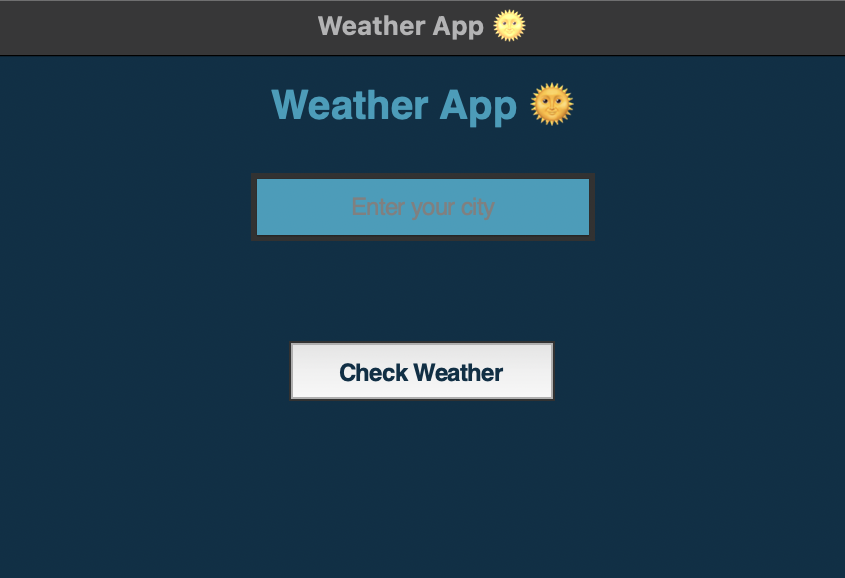

# 🌤️ Weather App

A simple desktop weather app built with Python and Tkinter that displays the current temperature and weather conditions for any city. Styled with a custom GUI and packaged as a macOS `.dmg` installer.

---

## ✨ Features

- Live weather data using OpenWeatherMap API
- Clean, styled interface with emoji weather icons
- Custom `.icns` app icon
- Packaged into a `.dmg` for macOS
- Built without frontend frameworks — just pure Python + Tkinter

---

## 🖼️ Screenshot



---

## 🛠️ Tech Stack

- Python 3.11
- Tkinter
- Requests (for API calls)
- PyInstaller (for packaging)
- create-dmg (for macOS installer)

---

## 🚀 How to Run

```bash
pip install -r requirements.txt
python main.py
